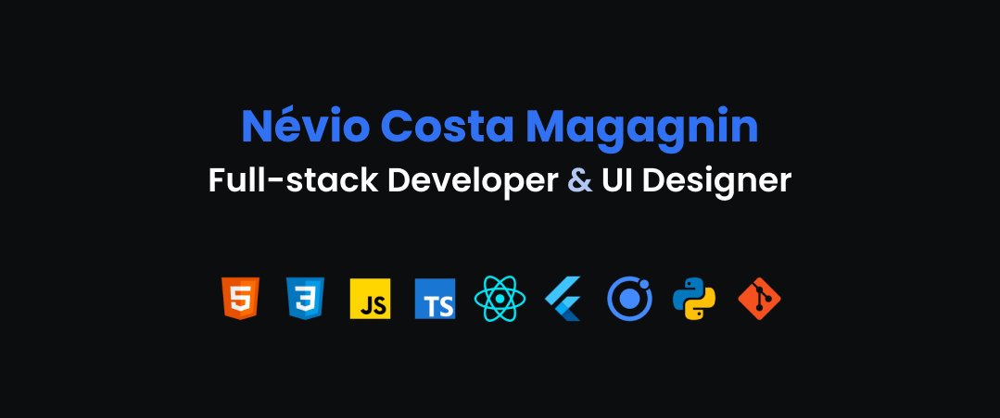

### Hello world :earth_americas:

My name is Névio Costa Magagnin, a front-end developer with some full-stack skills and UI designer. I love working with software development since I started studying in 2018 in a technical course.

I am always trying my best to improve my skills. For that, I have been working in personal projects, company projects and freelancers. For the future I want to become a great Software Engineer and have my own company.

I am very skillful for web and mobile development, here are some of my bests skills:
- React
- React Native
- Next
- JavaScript
- TypeScript
- Python

Follow me in my social network for more

   
  
   
  
  

